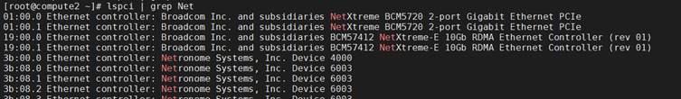

RST文件编辑
==============================

学习如何编辑rst文件

----------------------------------------------

1.1 列表（二级标题）
----------------------------

**无序列表**

（需要缩进，星号+一个空格）
 
eg:
 
 * Agilio CX 2x10G AMDA0096
 * Agilio CX 2x25G AMDA0099
 * Agilio CX 1x40G AMDA0081
 * Agilio CX 2x40G AMDA0097

**有序列表**

（需要缩进，井号+一个点+一个空格）

用井号会默认生成1、2、3这样的序列号，如果不想使用这种序号字符，可以标明第一个序号字符后，第二个及之后依旧用井号表示。

eg:

 1. Run the following command::
  
     # cd /home/yong/code/corenic-docs-private
     # ls
     # cd user-guide
     # sudo make latexpdf

 #. Run the following command::
   
     # cd /home/yong/code/disa-user-guide-private/
     # sudo make latexpdf 
  
 #. Run the following command::
 
     # reboot

**定义列表**

名词和定义内容分两行，定义内容需要缩进。

DPDK（名词）
  数据平面开发套件（定义内容）

**字段列表**

:标题: reStructuredText语法说明

:作者:
 - Seay
 - Seay1
 - Seay2

:时间: 2016年06月21日

:概述: 这是一篇关于reStructuredText语法说明。

-------------------------------------------------------------------------------------------

1.2 超链接（二级标题）
------------------------
 
**直接链接外部网址**

eg: For details, see https://corigine.atlassian.net/browse/OVSPPS-104

**引用链接** 

格式1    **`名称 <url>`_**

eg: For details, see `Technical Support <https://www.corigine.com.cn/cn/index.html>`_.

格式2    **`名称`_ 换行后，两个点+一个空格+冒号+空格+url**

eg:

示例1：

详情请参见 `Corigine官网`。

.. : https://www.corigine.com.cn/cn/index.html

示例2：

For details, see `Technical Support`_.

.. _: https://www.corigine.com.cn/cn/index.html

**链接内部内容**   

格式：两个点+一个空格+下划线+名称

eg:

示例1：

可参见 文字块_。

.. _文字块:

示例2：

详情请参见 列表_。

.. _列表：

---------------------------------------------------------------------------------------

1.3 文字块（二级标题）
-----------------------------

**展示命令的文本框可用以下样式，双冒号下空行，另起一行后需要缩进** 

eg:

请参见以下命令:: 

 # ping 10.0.0.2
 PING 10.0.0.2 (10.0.0.2) 56(84) bytes of data.
 64 bytes from 10.0.0.2: icmp_seq=3 ttl=64 time=0.067 ms
 64 bytes from 10.0.0.2: icmp_seq=4 ttl=64 time=0.062 ms

**python交互式应用，不需要加双冒号**

eg：

请参见以下内容：

>>> a=[1,2,3,4,5]
>>> print(a[2::2])
[3,5]

**无修饰的行句**

eg:

--set-aneg=:

 | S search - Search through supported modes until link is found. Only one side should be doing this. 
     It may result in a mode that can have physical layer errors depending on SFP type and what the 
     other end wants. Long DAC cables with no FEC WILL have physical layer errors.
 
 | A auto - Automatically choose mode based on speed and SFP type.

 | C consortium - Consortium 25G auto-negotiation with link training.
 
 | I IEEE - IEEE 10G or 25G auto-negotiation with link training.
 
 | F forced - Mode is forced with no auto-negotiation or link training.

--------------------------------------------------------------

1.4 说明/注意事项（二级标题）
-----------------------------------

.. note::

   The ethtool interface is only available for hosts running kernel 4.16 or higher when using the in-tree driver. Please use the out of tree driver to enable ethtool      flashing on older kernels.
   
.. warning::

   该操作需在xxx环境下进行。
   
.. attention::

   禁止xxxxxxxxxx。

.. danger::

   不得将该物品放置在xxxxxxx环境下。
   
.. tip::

   xxxxxxx.

.. error::

   xxxxxxxxxxxxxxxxxxxx.
   
   
--------------------------------------------------------------------

1.5 表格（二级标题）
-------------------------

表格列表（三级标题）
^^^^^^^^^^^^^^^^^^^^^^^^

-a            command-line option "a"
-b file       options can have arguments and long descriptions
--long        options can be long also
--input=file  long options can also have arguments
/V            DOS/VMS-style options too

绘制表格（三级标题）
^^^^^^^^^^^^^^^^^^^^^^^^

Table：

+------------------+------------------------------+
| Abbreviation     | Meaning                      |
+==================+==============================+
| DPDK             | Data Plane Development Kit   |
+------------------+------------------------------+
| VF               | Virtual Functions            |
+------------------+------------------------------+

SimpleTable：

=======    ======================================   ===================
缩略语      全称                                     描述
DPDK       Data Plane Development Kit               数据平面开发套件
VF         Virtual Functions                        虚拟化功能
UEFI       Unified Extensible Firmware Interface    统一的可扩展固件接口
VLAN       Virtual Local Area Network               虚拟局域网
VNF        Virtualized Network Functions            虚拟化网络功能
=======    ======================================   ===================

The following table summarizes the features of OVS-TC. More detailed summaries follow hereafter.

+------------------------------------------------------------------+
|OVS-TC Feature List                                               |
+--------------------+---------------------------------------------+
|Flow based features | Flow match offload                          |
+                    +---------------------------------------------+
|                    | Flow action offload                         |
+--------------------+---------------------------------------------+
|More advanced flows | Tunnel match fields (general)               |
+                    +---------------------------------------------+
|                    | Tunnel set fields (general)                 |
+                    +---------------------------------------------+
|                    | Tunnel types                                |
+                    +---------------------------------------------+
|                    | Conntrack                                   |
+--------------------+---------------------------------------------+
|Configurations      | Bonding (using kernel bonds)                |
+                    +---------------------------------------------+
|                    | Bonding (using OVS bonds)                   |
+                    +---------------------------------------------+
|                    | Tunnel+bonding                              |
+                    +---------------------------------------------+
|                    | Tunnel+VLAN                                 |
+                    +---------------------------------------------+
|                    | Tunnel+VLAN+bonding                         |
+                    +---------------------------------------------+
|                    | Two different tunnel configurations         |
+                    +---------------------------------------------+
|                    | Ingress QoS                                 |
+--------------------+---------------------------------------------+
|Other               | VFs                                         |
+                    +---------------------------------------------+
|                    | Wildcard flows                              |
+                    +---------------------------------------------+
|                    | Ethtool offloads                            |
+                    +---------------------------------------------+
|                    | Max MTU                                     |
+                    +---------------------------------------------+
|                    | Fallback path for unsupported flows         |
+                    +---------------------------------------------+
|                    | Port breakout nodes                         |
+--------------------+---------------------------------------------+

Flow match offload

+-----------------+---------------------------------------------------+
| in_port         |                                                   |
+-----------------+---------------------------------------------------+
| Layer 2         | src_mac, dst_mac                                  |
+-----------------+---------------------------------------------------+
| Layer 2.5       | mpls, label, tos, bos                             |
+                 +---------------------------------------------------+
|                 | Single VLAN: VID, TCI, PCP                        |
+                 +---------------------------------------------------+
|                 | Double VLAN (QinQ): VID, TCI, PCP in both fields  |
+-----------------+---------------------------------------------------+
| Layer 3         | IPv4: src, dst, proto ttl, ToS, Frag              |
+                 +---------------------------------------------------+
|                 | IPv6: src, dst, next header, hop limit, tos, frag |
+-----------------+---------------------------------------------------+
| layer 4         | TCP: src, dst, flags                              |
+                 +---------------------------------------------------+
|                 | UDP: src, dst                                     |
+                 +---------------------------------------------------+
|                 | SCTP: src, dst                                    |
+-----------------+---------------------------------------------------+

Flow action offload

+-----------------+---------------------------------------------------+
| Layer 2         | set_src, set_dst                                  |
+-----------------+---------------------------------------------------+
| Layer 2.5       | VLAN: push, pop, set                              |
+                 +---------------------------------------------------+
|                 | MPLS: push, pop, set                              |
+-----------------+---------------------------------------------------+
| Layer 3         | IPv4: set_src, set_dst, set_ttl, set_tos          |
+                 +---------------------------------------------------+
|                 | IPv6: set_src, set_dst, set_ttl, set_tos          |
+-----------------+---------------------------------------------------+
| layer 4         | TCP: set_sport, set_dport                         |
+                 +---------------------------------------------------+
|                 | UDP: set_sport, set_dport                         |
+-----------------+---------------------------------------------------+

.. note::
   * “-” 表示分隔行， “=”表示分隔表头和表体行，“|”表示分隔列，“+”表示行和列相交的节点。
   * 简单表格只有“=”和“-”。
   
--------------------------------------------------------

1.6 图片
------------------

插入图片，注意图片存放层级。下面两张图片就位于不同层级。

示例1：

下图存放路径在与此文件并列的image文件夹下。

示例2：

登录服务器系统，执行命令\ **lspci | grep Net**\，查看网卡PCIe基本信息，获取网卡设备的PCIe地址。

上图存放路径在于此文件并列目录下。

.. note::

   这里加粗字体在书写时需要在两边加上“斜杠”（见上面举例），用于隔开两边的字符。否则加粗不生效。
   
   
----------------------------------------------------

1.7 脚注
-------------------

插入脚注，在需要添加脚注的词后

这本历史名著——《资治通鉴》 [#F1]_

.. [#F1] 《资治通鉴》，司马光著...

1.8 注释
----------------------------------------

格式：两个点（即..），换行后需要缩进再书写注释内容。

..
 This is a comment.
